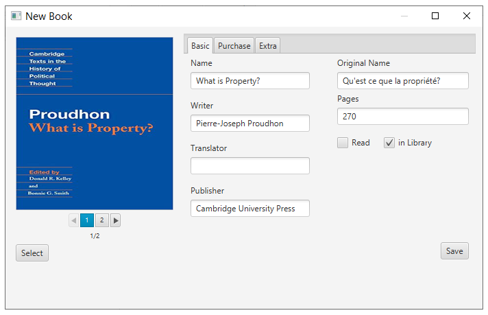
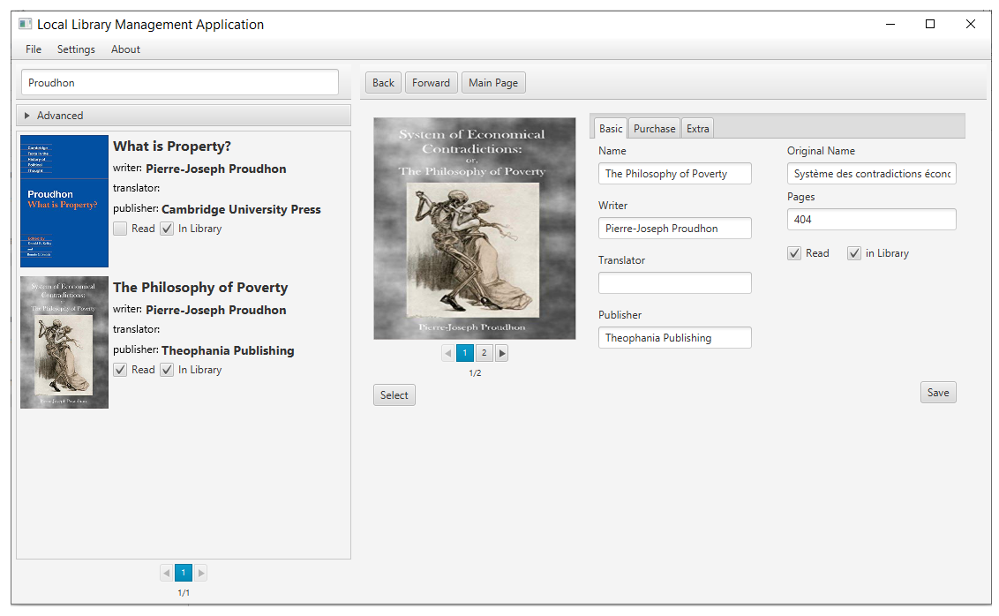

# local-lib - Local Library Management Application

### Project Definition

This project is dedicated to provide a library management system which handles one's own local library. It basically provides three essential functionalities; adding a book into the libray, searching over the library and changing information of a book. It is written in JAVA and given graphical user interface with JavaFX library.

### Using

The project is built with [Maven](https://maven.apache.org/). The Maven Project produces a executable **.jar** file typing following command: `mvn clean package`. After the project packaged, related **.jar** file can be found under `target\project.jar` and should be run safely. The project needs a config file in the same directory with it as a default to run properly.

### Screenshots

